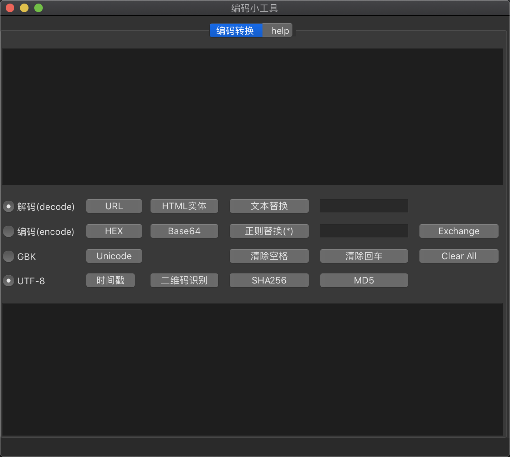

# CodingTools
用PyQt5写的一个关于编码的小工具

## 支持的功能
简单实现了如下功能的编码与解码，可以选择UTF-8或GBK字符集
- URL  
- base64  
- hex  
- Unicode  
- 时间戳转换  

图片文件形式的二维码识别  
文本、文件md5、sha256计算  
简单文本替换  

## 界面

运行  
`python3 main.py`  

以上在Mac上测试通过，Windows未做测试，可能会有一些界面错位或者路径问题    

## TODO
### 功能
✅标签页  
✅去换行，去空格  
✅二维码识别  
✅读取文件，文件md5、sha256检验  
HTML实体字符  
替换文本高亮显示  
正则替换  
hex编码支持分割符  
多线程  

### 其他
✅文档  
✅打包  
插件式开发  
文件优化：模块化  
吸取优秀工具的经验  
